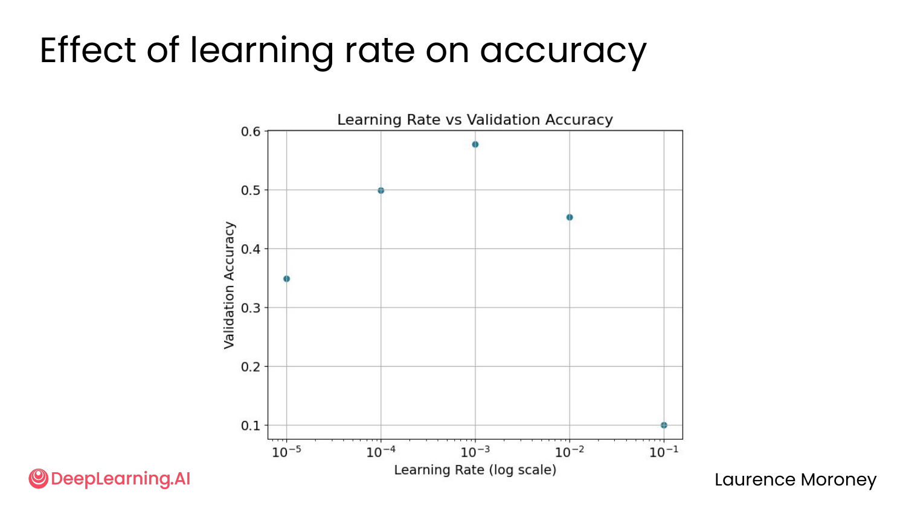
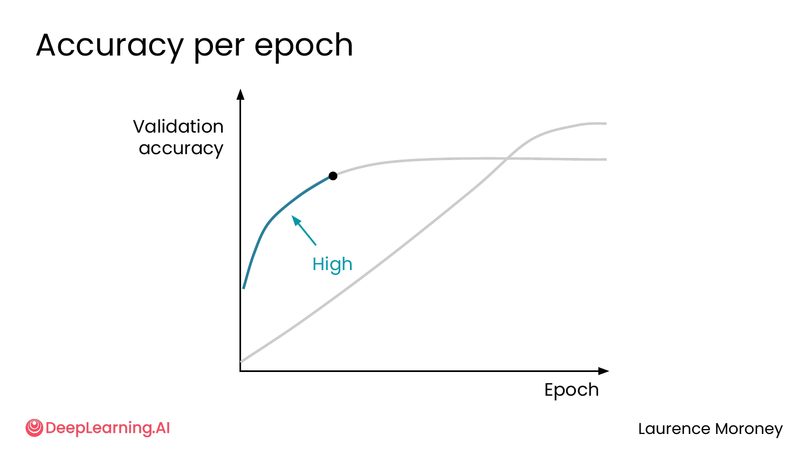
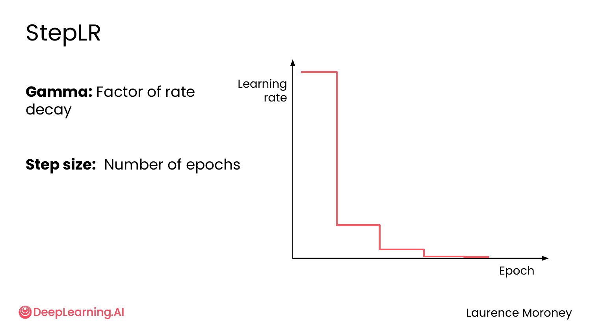
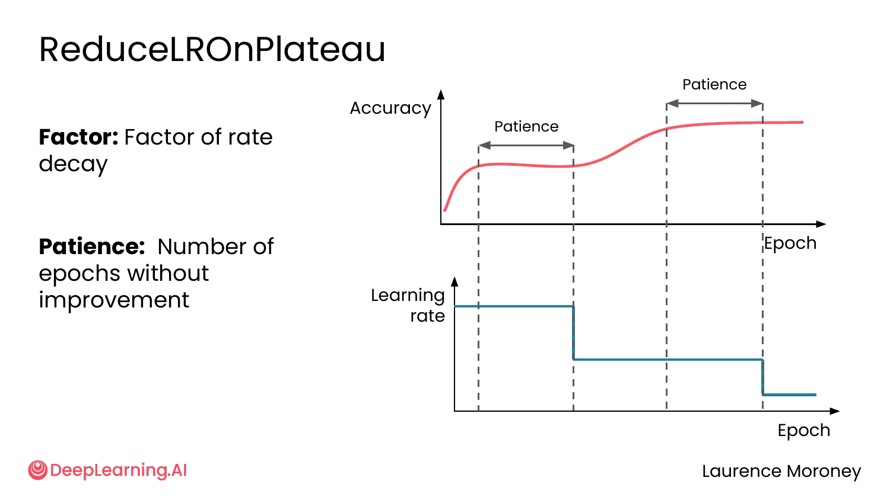
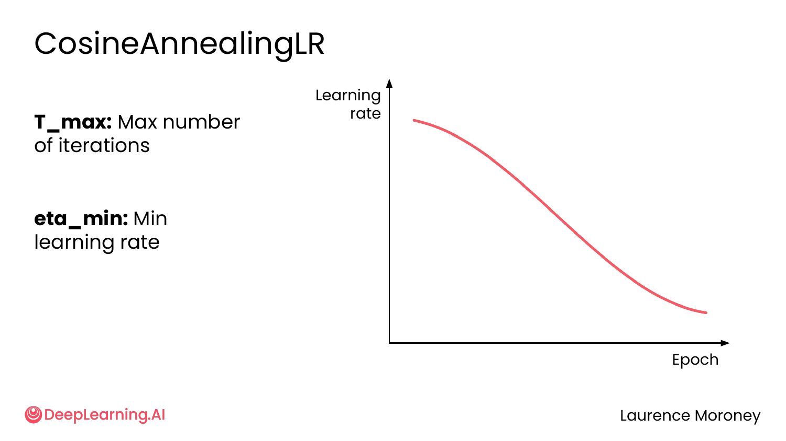

# PyTorch – Optimization & Learning Rate Schedulers

> Notes from *PyTorch for Deep Learning Professional Certificate* · DeepLearning.AI  
> Course 2 – Module 1 | Chapters: Introduction to Optimization · Learning Rate Schedulers

---

## Table of Contents

1. [Introduction to Optimization](#1-introduction-to-optimization)
2. [Learning Rate Schedulers](#2-learning-rate-schedulers)

---

## 1. Introduction to Optimization

### What is Optimization?

**Optimization** means systematically tuning hyperparameters to push a target metric as far as possible in the desired direction.

```
MAXIMIZE                        MINIMIZE
────────────────────────────────────────────
Accuracy                        Training time
Precision                       Inference time
Recall                          Mean Squared Error
F1 Score                        Log loss
```

A **hyperparameter** is any setting that controls *how* the model trains — not learned from data, but chosen by you. The learning rate is the most fundamental one.

---

### The Learning Rate Effect

The learning rate determines the step size the optimizer takes when updating weights each iteration. Its relationship with accuracy follows a clear pattern:



- **Too small** → training is slow, model stagnates at a suboptimal point
- **Too large** → model bounces around, never converges
- **Just right** → highest accuracy

This forms an **inverted U-shape**: performance is low at both extremes, peaks in the middle. The goal of optimization is to find that peak.

---

### Before Tuning: Check External Factors First

Before touching any hyperparameter, rule out **data problems**. The model can only be as good as what you feed it.

```
EXTERNAL FACTORS (check these first)
──────────────────────────────────────────────────────────
Data quantity      Not enough examples of a class?
                   → Model won't learn to recognize it
                   → Gather more data from open datasets

Data quality       Noisy labels (daffodil labeled as sunflower)?
                   → Model learns wrong patterns
                   → "Garbage in, garbage out"

Feature quality    Blurry or low-resolution images?
                   → Model can't find useful patterns
                   → Apply preprocessing: resize, crop, normalize
```

Only once data is solid should you move to internal model improvements.

---

### Internal Hyperparameters to Tune

```
INTERNAL FACTORS
──────────────────────────────────────────────────────────
Architecture       Number of layers, neurons per layer,
                   activation functions

Regularization     Dropout rate, weight decay

Training           Learning rate, batch size,
                   number of epochs, optimizer choice
```

Throughout this module, we'll explore techniques to systematically search for the best combination of these settings.

---

## 2. Learning Rate Schedulers

### Why a Fixed Learning Rate Falls Short

A fixed learning rate always forces a trade-off between speed and precision:



- **High LR:** Accuracy rises fast in early epochs, then flatlines
- **Low LR:** Climbs slowly but eventually surpasses the high LR — at the cost of many more epochs

**The question:** Can we get the fast start of a high LR *and* the precision of a low LR?  
**The answer:** Yes — with a **learning rate scheduler**.

---

### What is a Scheduler?

A scheduler **dynamically adjusts the learning rate during training** — typically starting high to learn quickly, then lowering to fine-tune. PyTorch provides three common ones:

```
1. StepLR              → Fixed interval decay
2. ReduceLROnPlateau   → Reactive decay (responds to performance)
3. CosineAnnealingLR   → Smooth cosine curve decay
```

---

### Scheduler 1: StepLR

**Idea:** Multiply the learning rate by `gamma` every `step_size` epochs — regardless of how the model is performing.



**Parameters:**
- `step_size` — how many epochs between each reduction
- `gamma` — multiplication factor at each step (e.g., 0.2 = reduce to 20%)

**Example:** LR=1.0, gamma=0.2, step_size=3
```
Epoch 0-2:  LR = 1.0
Epoch 3-5:  LR = 1.0 × 0.2 = 0.2
Epoch 6-8:  LR = 0.2 × 0.2 = 0.04
...
```

**PyTorch:**
```python
scheduler = optim.lr_scheduler.StepLR(optimizer, step_size=10, gamma=0.2)
# At the end of each epoch:
scheduler.step()
```

✅ Simple and predictable  
⚠️ Reduces blindly — doesn't respond to actual model performance

---

### Scheduler 2: ReduceLROnPlateau

**Idea:** Only reduce the learning rate when the model stops improving. Watches a metric and reacts.



**Parameters:**
- `mode` — `'max'` if tracking accuracy (higher = better), `'min'` if tracking loss (lower = better)
- `factor` — multiplication factor when reducing (e.g., 0.2)
- `patience` — how many epochs to wait without improvement before reducing

**Example:** patience=3, factor=0.2, mode='max'
```
Epochs 1-3:  Accuracy improves → no change to LR
Epoch 4-6:   Accuracy stalls for 3 epochs (patience) → LR × 0.2
Epoch 7-9:   Accuracy improves again → no change
Epoch 10-12: Accuracy stalls again → LR × 0.2
```

**PyTorch:**
```python
scheduler = optim.lr_scheduler.ReduceLROnPlateau(
    optimizer, mode='max', factor=0.2, patience=3
)
# Pass the metric you're monitoring at end of each epoch:
scheduler.step(val_acc)
```

✅ Adaptive — only reacts when actually needed  
✅ Won't reduce if the model is still learning  
⚠️ Requires monitoring a validation metric each epoch

---

### Scheduler 3: CosineAnnealingLR

**Idea:** Smoothly reduce the learning rate following a cosine curve from its initial value down to a minimum — no sudden drops.



**Parameters:**
- `T_max` — total number of epochs (length of the cosine cycle)
- `eta_min` — minimum learning rate at the end of training

**PyTorch:**
```python
scheduler = optim.lr_scheduler.CosineAnnealingLR(
    optimizer, T_max=n_epochs, eta_min=0.0002
)
# At the end of each epoch:
scheduler.step()
```

✅ Smoothest transition — no abrupt drops  
✅ Generally produces stable, gradual convergence  
⚠️ Less responsive to actual performance than ReduceLROnPlateau

---

### Comparison

| Scheduler | When LR Reduces | Reacts to Performance? | Best For |
|-----------|----------------|----------------------|----------|
| **StepLR** | Every N epochs (fixed) | ✗ No | Predictable training schedules |
| **ReduceLROnPlateau** | When metric stalls | ✓ Yes | Unknown training dynamics |
| **CosineAnnealingLR** | Continuously (cosine) | ✗ No | Smooth, stable convergence |

---

### Best Practice

> **Start with a fixed learning rate as your baseline.**  
> Only introduce a scheduler once you've confirmed the model trains correctly.

The scheduler's own settings (`step_size`, `patience`, `gamma`, `eta_min`) are themselves hyperparameters that need tuning — adding a scheduler means more things to optimize. Later in this module, you'll see automated strategies to handle this.

---

*Course: PyTorch for Deep Learning Professional Certificate · DeepLearning.AI*
