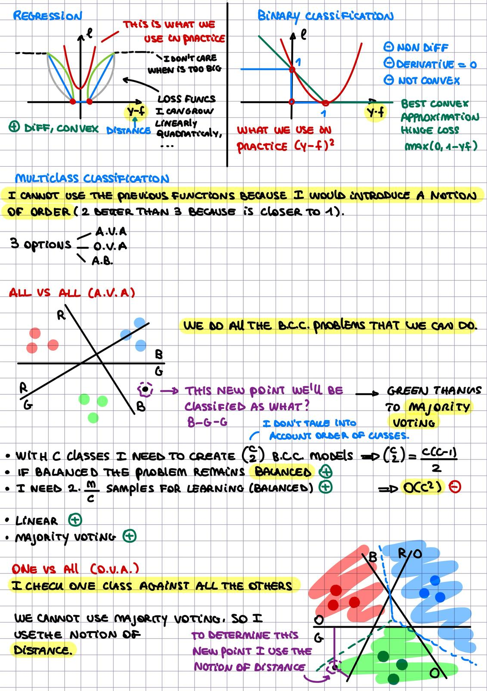
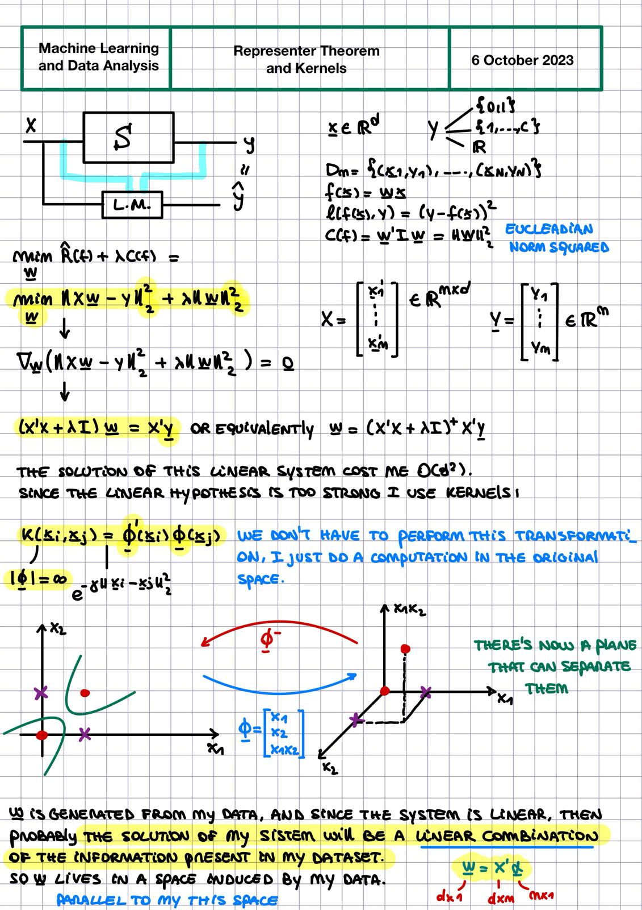

# Machine Learning

Welcome to my Machine Learning repository, where you can find learning materials both from my studies and from various online courses.

## Folders Structure

- **`DL/`**: Directory containing notes and notebooks from the "**Machine Learning and Data Analysis**" and "**Deep Learning**" courses at UNIGE.

- **`ML/`**: Directory containing notes and notebooks from the "**Machine Learning and Data Analysis**" course at UNIGE.

- **`NLP/`**: Directory dedicated to **Natural Language Processing**.

- **`TAI/`**: Notebooks used during the "**Trustworthy Artificial Intelligence**" course at UNIGE.

## What You'll Discover

These are just two examples of the notes you will find plus some notebooks :)

    <!-- First image with caption -->
    

        
        
MultiClass Classification
 <!-- Caption for the first image -->
    

    <!-- Second image with caption -->
    

        
        
Kernels
 <!-- Caption for the second image -->
    

